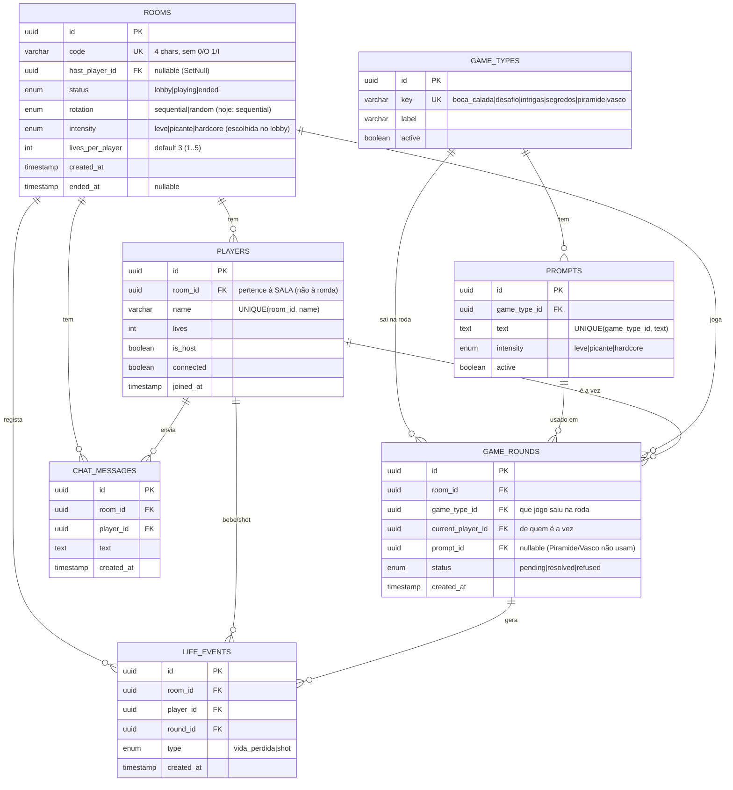

# F&D — Modelo de dados (ER adequado ao que existe hoje)

> Reconciliação do diagrama ER do Miguel (`fd (1).pdf`) com o schema **já a correr**
> na Supabase (`prisma/schema.prisma` → `db/01_schema.sql`). Mantém as boas ideias
> dele, corrige o que não encaixa e acrescenta o que faltava (sobretudo `prompts`).

## Nota de arquitetura (ler primeiro)

A app é **memory-first**: as **salas, jogadores e rondas ativas vivem em memória**
no servidor (`RoomManager`) para latência mínima. A **base de dados** guarda hoje
**só o conteúdo** (`game_types` + `prompts`). As tabelas `rooms/players/game_rounds/
life_events/chat_messages` são uma camada **opcional de persistência/histórico**
(snapshot + estatísticas) — o schema já as prevê, mas o runtime ainda não escreve
nelas. Portanto:

- **Adequado a HOJE (obrigatório):** `game_types`, `prompts`.
- **Para persistência/estatísticas (quando quisermos):** o resto do diagrama.

## Diagrama (renderiza no GitHub)

**Enums** (native no Postgres; equivalem às tabelas de lookup do diagrama do Miguel):
`RoomStatus(lobby,playing,ended)` · `Intensity(leve,picante,hardcore)` ·
`RoundStatus(pending,resolved,refused)` · `LifeEventType(vida_perdida,shot)`.

## Reconciliação com o diagrama do Miguel

| Dele | Decisão | Porquê |
|---|---|---|
| Lookup: `game_status`, `round_status`, `game_intensity`, `game_selection` | **Mantido, como ENUM** | Conjuntos pequenos e fixos → enum é mais simples e já está deployado. (Lookup em tabela é válido se quiseres adicionar valores sem migração — trade-off.) |
| `game_type` + `game_type_rules` | **Mantido `game_types`**, `rules` **opcional/não usado** | As regras/mecânicas vivem no **código** (Piramide/Vasco). O conteúdo textual são os `prompts`. |
| ❌ (não existia) `prompts` | **ADICIONADO** | É o núcleo: dezenas de desafios por jogo × intensidade. Base da app e da admin. |
| `player.player_room_round_id` (FK→ronda) | **CORRIGIDO → `player.room_id`** | O jogador pertence à **sala** e persiste entre rondas (vidas, identidade). |
| `room_round.winner NOT NULL` | **Removido/nullable; + `current_player_id`** | Poucas rondas têm "vencedor"; quem bebe fica em `life_events`. Falta era *de quem é a vez*. |
| `room_game_being_played_id`, `..._round_being_played_id` | **→ `game_rounds.game_type_id` (+ `prompt_id`)** | Nomes ambíguos; a ronda referencia o **tipo de jogo** e o prompt. |
| PKs "int, sem ser incremental" | **→ UUID** | Menos frágil que IDs manuais; é o que já usamos. |
| `room_validity_time_min DEFAULT 12H` | **Simplificado** | Guardar minutos (ex.: 720) ou usar `created_at`+grace. Hoje a limpeza de salas vazias é por *grace period* em memória (120s). |
| ❌ `chat_messages`, `life_events` | **ADICIONADOS** | Temos chat de grupo; e o log de vidas dá as estatísticas ("quem bebeu mais / shots"). |
| `room_code_blacklist` | **Opcional (não incluído no core)** | Hoje os códigos libertam-se ao apagar a sala; útil só se quiseres reservar códigos após o fim. |
| `room_game_type` (jogos ativos por sala + intensidade) | **Boa ideia — FUTURO** | Hoje os 6 jogos estão sempre na roda e a intensidade é uma só por sala. Se um dia o host escolher **que jogos entram**, esta junção é o caminho. |

## Extensões opcionais (se quiserem ir além do de hoje)
- **`room_game_type`** (sala × game_type, `is_active`, `intensity`) → host escolhe jogos/intensidade por jogo.
- **`room_code_blacklist`** → reservar códigos após o fim da sala.
- **`questions` / `secrets`** (Boca Calada / Segredos) → hoje são dados de sessão (memória); só valem em BD se quiseres histórico.
